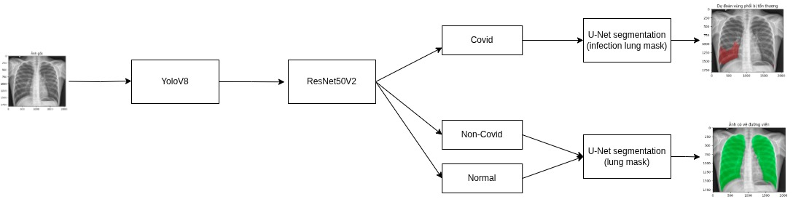
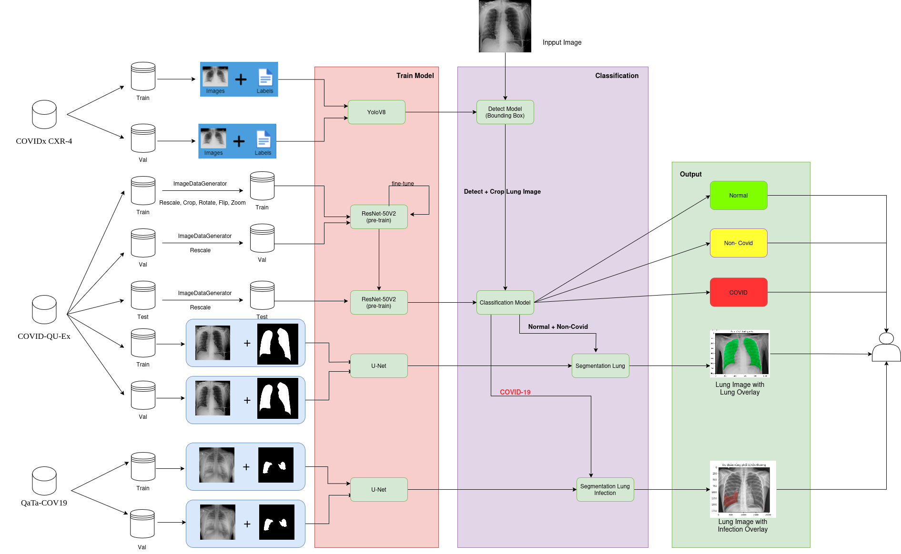
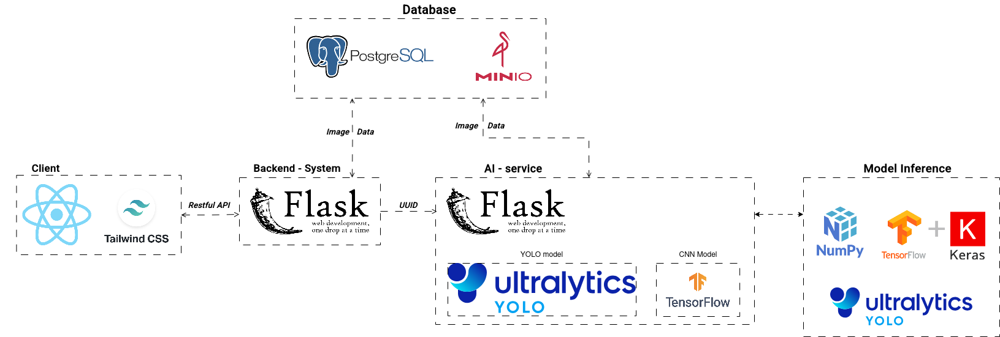

# 🦠 COVID-19 Chest X-ray Screening System

This repository contains the graduation thesis project of Nguyễn Sinh Hùng from Ho Chi Minh Open University. The project focuses on building a deep learning-based screening system that classifies chest X-ray images to detect SARS-CoV-2 (COVID-19) infection and segment infected lung regions.

## 📌 Abstract
The COVID-19 pandemic has underscored the need for fast and accurate diagnostic tools. While RT-PCR remains the gold standard, its high cost and slow turnaround have led to interest in alternative approaches. Chest X-rays (CXR), being more accessible and affordable, are widely used but require expert interpretation.

This project proposes an AI-powered screening system that integrates multiple deep learning models:
- YOLOv8: Detects and localizes the lung regions in chest X-ray images.
- ResNet-50V2: Classifies the lung image into three categories: COVID-19, Non-COVID pneumonia, and Normal.
- U-Net: Segments infected regions in lungs if COVID-19 is detected.

## 🧠 Objectives
- Develop a low-cost, fast, and accurate solution for COVID-19 screening using chest X-ray images.
- Provide an automatic classification pipeline to assist radiologists and clinicians.
- Enhance diagnostic insight by visualizing infected lung areas.

## 📂 Datasets
- [COVID-QU-Ex](https://www.kaggle.com/datasets/anasmohammedtahir/covidqu): Chest X-ray dataset with lung segmentation masks.
- [QaTa-COV19](https://www.kaggle.com/datasets/aysendegerli/qatacov19-dataset): High-quality CXR with annotated infected regions.
- [COVIDx CXR-4](https://www.kaggle.com/datasets/andyczhao/covidx-cxr2): Large-scale open dataset (67,000+ CXR images).

## 🔄 Pipeline
The project follows a multi-stage AI pipeline:

## Approach

## 🧪 Model Training
| Model | Purpose |	Input Size | Epochs | Metrics |
|-------|---------|-------------|--------|---------|
|YOLOv8n| Lung detection |	640×640 |	30	|mAP@50 = ~1.0
|ResNet-50V2| Multi-class classification|	200×200|	50	| Accuracy, F1, ConfMat
|U-Net|	Infection segmentation | 256×256 |	10	| IoU, Dice Score

**Hardware: Google Colab with NVIDIA A100 (40GB VRAM)**

## 🔬 Results

    YOLOv8 achieved near-perfect detection accuracy (mAP@50 ≈ 1.0).

    ResNet-50V2 fine-tuned model achieved high accuracy with balanced class performance.

    U-Net successfully segmented infected lung regions with strong IoU and Dice metrics.

## 🧰 Tech Stack

**Client:** React, Redux, TailwindCSS, Axios 

**Server:** Flask

**Database:** Postgres, MinIO - simulate S3

## 🏗️ Architecture

## 🚀 Future Work

<!-- Expand classification to more respiratory diseases

Integrate model into hospital systems via HL7/FHIR -->

- Add real-time analytics for epidemic monitoring
- Support mobile and cross-platform deployment

## 🔗 Live Demo
📽️ Demo Video: [Drive Link](https://drive.google.com/file/d/1tGWlY7obSUMqLO_AbtLTcjQkzCIEHUqU/view?usp=sharing)

## 🧑‍🎓 Author & Advisor
- 👨‍💻 Student: Nguyễn Sinh Hùng
- 🎓 Advisor: Dr. Lê Viết Tuấn
- 🏫 Faculty: Computer Science, Ho Chi Minh Open University
- 📅 Thesis Year: 2025

## 📜 License
This project is developed for academic research. Please contact the author for any questions regarding data use or extension.